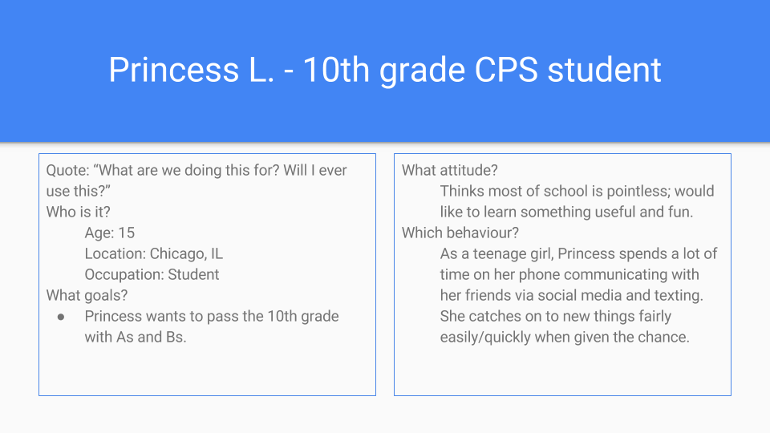
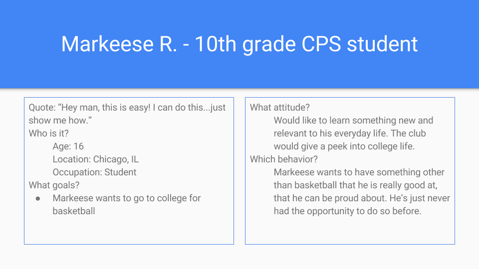
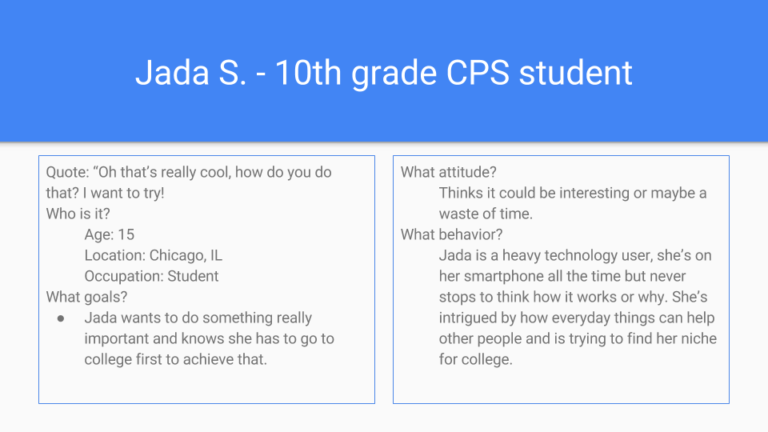

# Code Club

## Description
A club that meets weelky after school to learn basic coding skills to create anything from a simple website to an intricate game designed by you!
  - An afterschool program to address the lack of creative technological knowledge and skills, knowing that high school students may not have at-home access to computers and/or internet, underpriveleged CPS students will have a safe space to learn and to create shareable products that will enhance their self-image and motivation.

### Features
1. Sign up: registers a student to participate in weekly meetings for either one semester or whole year
2. Network: students are given the opportunity to work together with students from their school plus students and other professionals around the city
3. Create/Play: the end product of the club/program is something the students came up with on their own or created together that they can share and use

## Context
### Motivation
I decided to start this project for high school students in the Chicago area because of the lack of opportunity. I can use my privilege to their advantage so that they can learn the skills necessary to succeed in the world they will be entering once leaving school. Too often is education neglected and infrequently updated to suite the students' needs.

## Personas
- 
  - **User Story: As a _student_ I want to _try another extracurricular activity_ so that _I can make more friends._**
- 
  - **User Story: As a _student_ I want to _add another extracurricular activity to my list_ so that _I can look more desirable to colleges._**
- 
  - **User Story: As a _student_ I want to _try new things_ so that _I can learn more and find what I'm looking for in my future._**

### User Flow
- all personas same: hears announcement introducing new club/afterschool program; sees posters around school advertising; sees or is given sign up sheets, will choose day and time for weekly meetings; notified about introductory meeting and attends, signs "contract" to attend and participate regularly; attends first meeting at chosen day and time in provided room at school;; attends all weekly meetings; collaborates with other participants; goes on excurisions with group to see what other groups are working on and accomplishing; makes new friends inside and outside of school; discovers new subjects and areas of interests;; gains knowledge to further own project; receives constructive feedback to finish project; uses experience to share finished project for schoolwide admiration and possible use.

## Resources and Thanks
Thank you to Uplift Community High School for allowing me to observe your classrooms.
