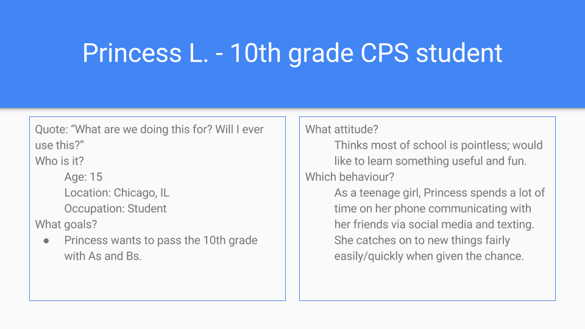
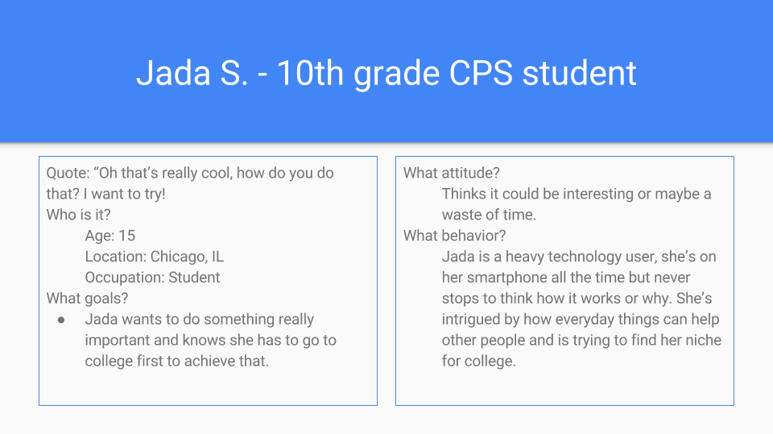

# Storify - Session 2
- List at least 4 groups directly impacted by your idea:
  - High school students
  - Underprivileged adolescents
  - Underfunded schools
  - Teachers and administrators
- List at least 4 groups peripherally related or connected to the direct groups:
  - Teachers and administrators
  - Parents
  - Siblings
  - Districts
- Supporters:
  - **Teachers**; gives students and teachers something to be passionate about
  - **Administrators**; makes their school look more advanced
  - **Parents**; allows more time to pick up kids or know that they are still safe at school
  - **Students**; something new and relevent to learn
- Critics:
  - **Administrators** may be concerned about budgets
  - **Districts** may not have the available funds and resources
  - **State** may not see the value
  - **Government** may not care to increase budget

## Personas

## Brainstorm Features
1. Sign up
  - User Flow (all personas same): hears announcement introducing new club/afterschool program; sees posters around school advertising; sees or is given sign up sheets, will choose day and time for weekly meetings; notified about introductory meeting and attends, signs "contract" to attend and participate regularly; attends first meeting at chosen day and time in provided room at school.
  - User Story: Princess: As a _student_ I want to _try another extracurricular activity_ so that _I can make more friends._
  - User Story: Markeese: As a _student_ I want to _add another extracurricular activity to my list_ so that _I can look more desirable to colleges._
  - User Story: Jada: As a _student_ I want to _try new things_ so that _I can learn more and find what I'm looking for in my future._
2. Network
  - User Flow: attends all weekly meetings; collaborates with other participants; goes on excurisions with group to see what other groups are working on and accomplishing; makes new friends inside and outside of school; discovers new subjects and areas of interests.
  - User Story: Princess:
  - User Story: Markeese:
  - User Story: Jada:
3. Create/Play
  - User Flow: attends all weelky meetings; collaborates with other participants; goes on excurisions with group to see what other groups are working on and accomplishing; gains knowledge to further own project; receives constructive feedback to finish project; uses experience to share finished project for schoolwide admiration and possible use.
  - User Story: Princess:
  - User Story: Markeese:
  - User Story: Jada:
