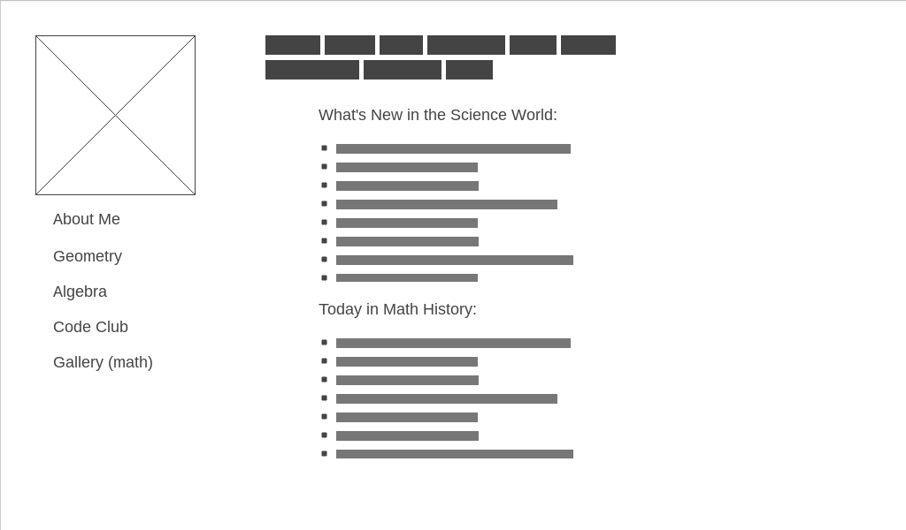
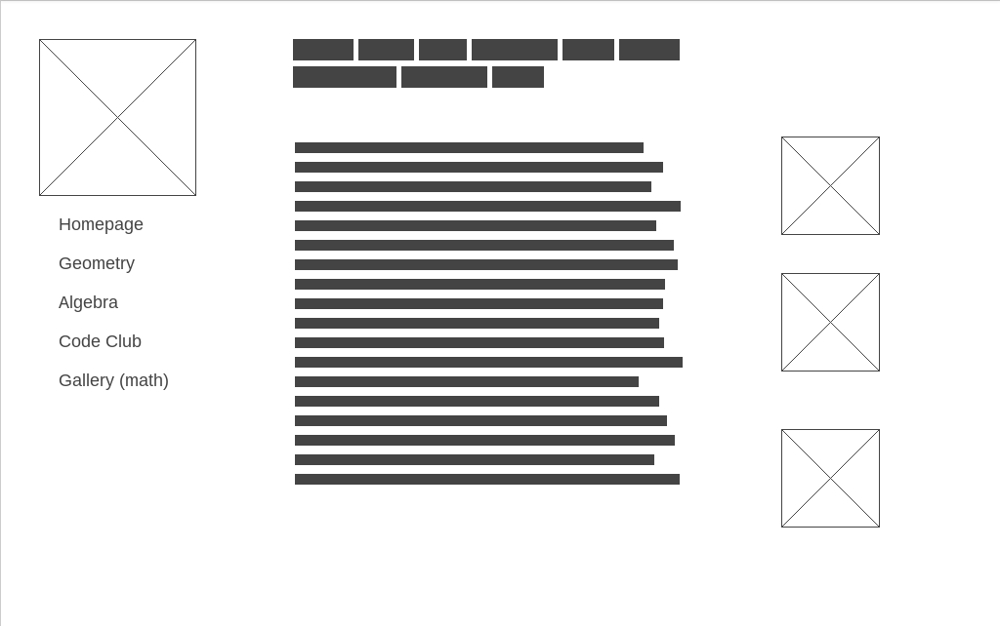
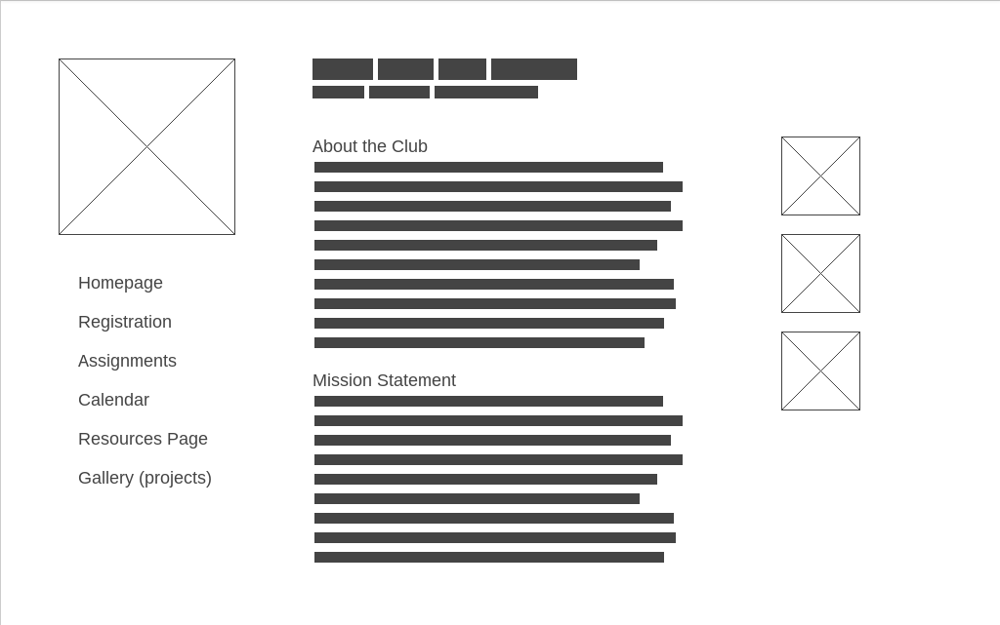

# What my website will look like!
  I have created three pages:
  1. Home page 
    - Side bar will be navigation links to other pages within website
    - Header will have my basic information
    - Picture on top left will be my headshot
    - Middle section will have links in list form about relevant articles, will update weekly/monthly
  2. About Me 
    - Same side bar and picture as homepage
    - Same header as homepage, maybe have subtitle
    - Body will be quick blurb(s) about my background and interests
    - Right side will be relevant pictures
  3. Code Club 
    - Main picture will be of something relevant to club
    - Side bar has navigation links to homepage and other pages related to Code Club
    - Body is two basic paragraphs explaining concept of the program
    - Relevant and fun pictures on the right 
